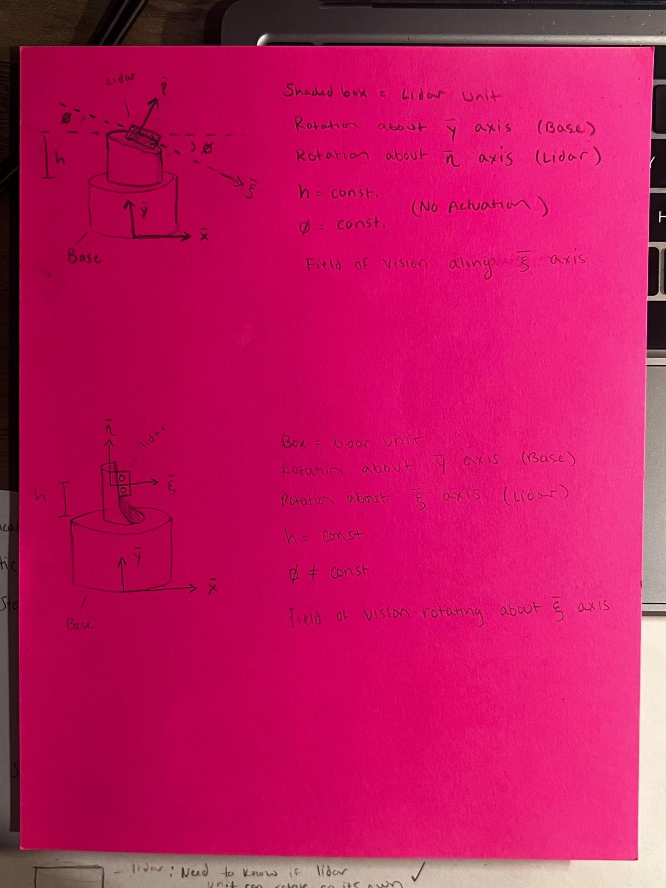
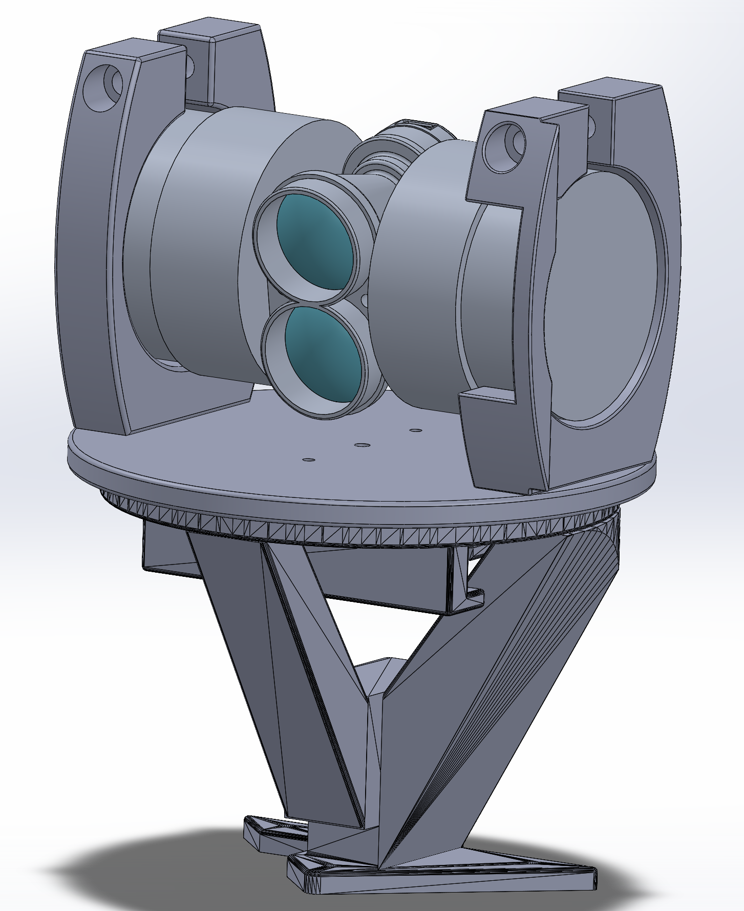
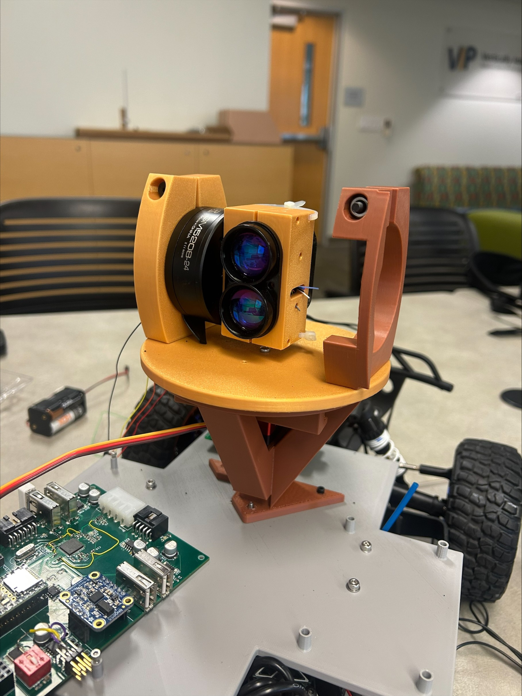

# 3D LiDAR Mount Assembly

This repo documents the Fall 2025 LiDAR mount redesign project. The project focused on iterating from the previous LiDAR mounting design, which provided a primarily 2D field of vision, into a multi axis mechanism capable of supporting a 3D field of vision for autonomous vehicle sensing.

The redesign added two rotational degrees of freedom, expanding LiDAR coverage from 2D to 3D. The final design includes a rotating base, LiDAR clamp, gimbal motor clamp, servo motor mount, and full LiDAR assembly. :contentReference[oaicite:0]{index=0}

## Project Goals

- Extend the LiDAR field of vision from 2D to 3D
- Add additional rotation around the y axis
- Support forward and reverse navigation
- Maintain visibility of approximately ten feet from the vehicle
- Design, CAD, prototype, and fabricate a functional LiDAR mounting mechanism

## Design Overview

The final concept uses two motor driven axes:

- A horizontal motor for left to right LiDAR rotation
- A vertical motor for up and down LiDAR rotation

The mechanism was designed to improve the vehicle’s environmental awareness by allowing the LiDAR sensor to scan beyond a fixed planar field of view.

## Design Progression

### Initial Sketch


### CAD Assembly


### Physical Prototype


## Repository Structure

```text
LiDAR Assembly CAD/
├── Snapshots/
├── Binocular Attachment 2.SLDPRT
├── Binocular Attachment.SLDPRT
├── LiDAR - Assembly.SLDASM
├── LiDAR - Base.SLDPRT
├── LiDAR - Bottom Clamp.SLDPRT
├── LiDAR - Top Clamp.SLDPRT
├── LiDAR Binoculars real.SLDPRT
└── Updated Base.SLDPRT

Snapshots/
├── 3DPrint.png
├── BaseAssembly.png
├── FinalAssembly.png
├── GimbalMotorClamp.png
├── LiDARClamp.png
├── Prototype.png
├── ServoMotorMount.png
└── Sketch.png

Team Presentation.pdf
